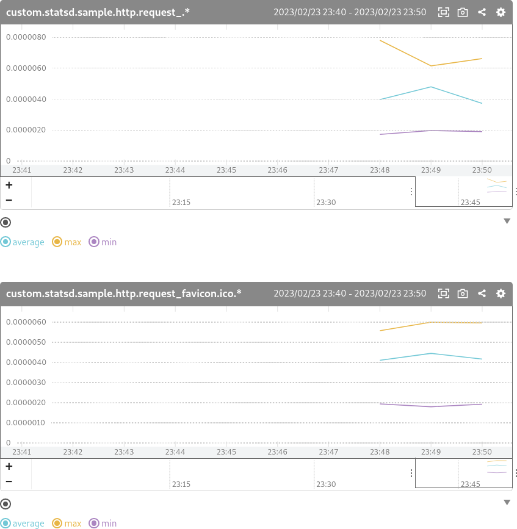

# mackerelstatsd

## 概要

**mackerelstatsd**は、StasDプロトコルに則ったメトリクスの合計値、あるいは最小値・最大値・平均を計算して[Mackerel](https://ja.mackerel.io/)に投稿するための、StasDサーバーです。

StatsDとはメトリクスを送信するシンプルなUDPプロトコルおよび処理系（[Etsy社のブログ](https://www.etsy.com/codeascraft/measure-anything-measure-everything/)および[オリジナルのStasDのGitHub](https://github.com/statsd/statsd)）で、アプリケーション開発者がメトリクス送信を実装するのは容易です。

## mackerelstatsdがなぜ必要か

2023年2月時点で、Mackerelは**1分**ごとにメトリクスを受け取ります。つまり、監視している対象の値がその1分の中で激しく変動していたとしても、Mackerelに格納されるメトリクスは取得時点の値だけです。

mackerelstatsdは、この問題を解決する一助となります。アプリケーションからStatsDプロトコルで投稿されるメトリクスをmackerelstatsdが保管し、1分ごとにそれらの合計値、あるいは最小値・最大値・平均値をMackerelに投稿します。これにより、1分よりも短い間に起きた変化を捉えることができます。

mackerelstatsdは、StatsDプロトコルのうち、Counting（カウンタ値を受け取るり、期間中の値の合計のメトリクスとなる）とTiming（ミリ秒を受け取り、最小値・最大値・平均値のメトリクスとなる）をサポートしています。

Timingの単位はミリ秒のみですが、Mackerelのグラフ画面上で単位を変更することで代替できます。

## 使い方

[Goの開発環境](https://go.dev/dl/)を用意し、`mackerel-statsd`フォルダ内でビルドを実行します。

```
go build
```

これで、`mackerelstatsd`ファイルが生成されます。

起動は以下の書式です。

```
MACKEREL_APIKEY=MackerelのAPIキー ./mackerelstatsd -host ホストID
```

- `MACKEREL_APIKEY`: MackerelのオーガニゼーションのAPIキーを指定します。書き込み（Write）を有効にしたAPIキーを生成してください。
- `-host`: メトリクスを紐付けるスタンダードホストのホストIDを指定します。

### サンプル

`example` フォルダにサンプルを置いています。それぞれのフォルダ内で `go run main.go` を実行することで試すことができます。

- `sample-client` : サイコロを10回振った出目の合計のメトリック（`custom.statsd.sample.dice`）と、はてな社トップページへのリクエストの10回のレイテンシーの平均・最大・最小のメトリック（`custom.statsd.sample.http.hatena.average/max/min`）を投稿します。間を置いて何度か実行してみてください。
- `sample-http-server` : ローカルホストの8080ポートでWebサーバーが待ち受け、リクエスト処理のレイテンシーの平均・最大・最小のメトリック（`custom.statsd.sample.http.request_.average/max/min`および`custom.statsd.sample.http.request_favicon.ico.average/max/min`）を投稿します。ブラウザで`http://localhost:8080`を開き、何度かリロードしてみてください。



### 自動サービス化

Linuxのsystemd環境向けのサービスファイルを用意しています。

1. 各ファイルをシステムにコピーします。

   ```
   sudo cp mackerelstatsd /usr/local/bin
   sudo cp example/systemd/mackerelstatsd.service /lib/systemd/system
   sudo mkdir -p /etc/sysconfig
   sudo cp example/systemd/mackerelstatsd.sysconfig /etc/sysconfig/mackerelstatsd
   ```

2. `/etc/sysconfig/mackerelstatsd`ファイルを編集し、Mackerel APIキー（`MACKEREL_APIKEY`）とホストID（`HOSTID`）をお使いのものに置き換えてください。

   ```
   sudo vi /etc/sysconfig/mackerelstatsd
   ```

3. systemdサービスを有効化します。

   ```
   sudo systemctl enable mackerelstatsd
   ```

## Overview

## Usage

## License / ライセンス

Copyright 2023 KADOTA, Kyohei

Licensed under the Apache License, Version 2.0 (the "License"); you may not use this file except in compliance with the License. You may obtain a copy of the License at

```
http://www.apache.org/licenses/LICENSE-2.0
```

Unless required by applicable law or agreed to in writing, software distributed under the License is distributed on an "AS IS" BASIS, WITHOUT WARRANTIES OR CONDITIONS OF ANY KIND, either express or implied. See the License for the specific language governing permissions and limitations under the License.
